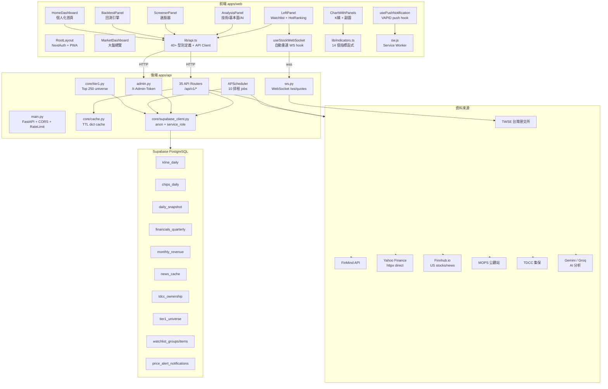

# StockPulse — 完整專案結構圖

> 本文件以 **3–4 層深度**描述 `stock-platform` 整體架構，涵蓋前端、後端、共用層、資料庫 Schema 及排程機制。  
> 最後更新：2026-06-10

---

## 目錄

1. [整體架構一覽](#整體架構一覽)
2. [前端 (apps/web)](#前端-appsweb)
3. [後端 (apps/api)](#後端-appsapi)
4. [共用層 / 型別定義](#共用層--型別定義)
5. [資料庫 Schema (Supabase)](#資料庫-schema-supabase)
6. [排程系統 (APScheduler)](#排程系統-apscheduler)
7. [安全性與合規](#安全性與合規)
8. [模組關係圖 (Mermaid)](#模組關係圖-mermaid)

---

## 整體架構一覽

```
stock-platform/
├── apps/
│   ├── web/          # Next.js 14 App Router 前端 (TypeScript)
│   └── api/          # FastAPI 後端 (Python 3.11+)
├── supabase/
│   └── migrations/   # PostgreSQL schema migrations
├── docs/             # 技術文件
├── scripts/          # 部署輔助腳本
└── turbo.json        # Turborepo monorepo 設定
```

**技術棧摘要：**

| 層 | 技術 |
|---|---|
| 前端 | Next.js 14 App Router · TypeScript · Tailwind CSS · lightweight-charts · NextAuth v5 |
| 後端 | FastAPI · Python · APScheduler · slowapi · Supabase Python SDK · Sentry |
| 資料庫 | Supabase (PostgreSQL) + Row Level Security |
| 快取 | In-process TTL dict（後端）· Module-level Map（前端）· Supabase 持久快取 |
| 即時通訊 | WebSocket (FastAPI) · Web Push / VAPID |
| 資料來源 | TWSE · FinMind · Yahoo Finance (direct httpx + yfinance) · Finnhub · MOPS · TDCC |
| 認證 | NextAuth v5 + Google OAuth · localStorage UUID（fallback） |
| 監控 | Sentry SDK (FastAPI + asyncio 整合) |
| 部署 | Render (API) · Vercel (Web) · Upstash Redis (選用) |

---

## 前端 (apps/web)

### 1. App Router 路由層 (`app/`)

#### 1.1 Root Layout (`app/layout.tsx`)
- **Google Fonts 載入**：Space Grotesk, IBM Plex Mono, Syne, Noto Sans TC（next/font 自動 preload）
- **防 FOUC 主題初始化**：`<script>` 在 hydration 前讀 `localStorage('stockpulse_theme')` 並設 `data-theme`
- **Server Session**：`auth()` server-side 取得 NextAuth session（graceful fallback：OAuth 未設定時回傳 null）
- **全域 Provider 掛載**：`SessionProviderWrapper` → `FeedbackWidget` → `AlertsToast`
- **SEO / PWA**：完整 `metadata`（Open Graph, Twitter Card, robots）、`manifest.json`、viewport

#### 1.2 首頁 (`app/page.tsx`) ← **唯一主要入口**
- 完整股票平台主頁（路由 `/`）
- 所有功能的入口：K線、籌碼、排行、大盤、選股、新聞、回測、分析、比較、月曆
- 功能包含：美股支援、前端快取（`withCache`）、Tab keep-alive（`mountedTabs`）、十字線懸停 OHLCV、鍵盤快捷鍵、全螢幕 K 線 Modal
- **2026-06-11 更新**：從 `app/dashboard/page.tsx` 完整同步，兩檔合一，`/dashboard` 路由退役

#### 1.3 儀表板 (`app/dashboard/`)
- `layout.tsx`：Dashboard 專屬 layout
- `page.tsx`：**已退役**（功能已全數移入 `app/page.tsx`，2026-06-11）

#### 1.4 個股頁 (`app/stock/[symbol]/`)
- `page.tsx`：動態路由，接收 `symbol` 參數
- `StockRedirect.tsx`：股票代號重定向邏輯

#### 1.5 API Routes (`app/api/`)
- `auth/[...nextauth]/`：NextAuth v5 handler（`handlers` from `@/auth`）

#### 1.6 PWA 圖示 Routes
- `app/icon.tsx`、`app/apple-icon.tsx`：動態產生 App Icon（next/og）
- `app/icon-192/route.tsx`、`app/icon-512/route.tsx`：PWA manifest 用圖示

---

### 2. 元件層 (`components/`)

#### 2.1 Layout 元件 (`components/layout/`)

##### 2.1.1 Header (`Header.tsx`)
- 搜尋框（呼叫 `/api/v1/market/search`）
- 主題切換按鈕（dark / light，寫 `localStorage('stockpulse_theme')`）
- 導覽連結
- `AuthButton` 登入狀態

##### 2.1.2 LeftPanel (`LeftPanel.tsx`)
- **自選股 Watchlist**
  - `DndContext` (dnd-kit)：拖曳排序
  - `SortableContext`：群組與項目排序
  - localStorage 本地快取 (`stockpulse_watchlist_v2`)
  - Supabase 遠端同步（X-User-ID header）
  - 群組 CRUD：新增、重命名、刪除（最後一組不可刪）
  - 項目 CRUD：加入、移除、拖曳重排
  - 價格提醒設定（`price_alert_above` / `price_alert_below`）
  - WebSocket 即時報價（`useStockWebSocket`，最多 50 個 symbol）
  - 報價顯示：漲跌色（up/down CSS vars）、漲跌幅 %
- **熱門排行 (HotRanking)**：`dynamic` lazy load（ssr: false）
  - 呼叫 `/api/v1/market/ranking`：漲幅榜、跌幅榜、成交量榜
- **切換 Tab**：自選股 ↔ 熱門排行

##### 2.1.3 RightPanel (`RightPanel.tsx`)
- 右側分析面板

---

#### 2.2 圖表元件 (`components/chart/`)

##### 2.2.1 KLineChart (`KLineChart.tsx`)
> 核心圖表引擎，基於 **lightweight-charts v5**

- **圖表類型** (`ChartType`)
  - `candle`：標準 K 線
  - `hollow`：空心 K 線
  - `heikin_ashi`：平均 K（重算 OHLC）
  - `line`：折線圖
  - `area`：面積圖
- **技術指標 overlay**（主圖上疊加）
  - MA (SMA)：可配置多週期（預設 5, 10, 20, 60）
  - EMA：可配置多週期（預設 12, 26）
  - Bollinger Bands（BB）
  - VWAP（滾動 + 累積）
  - VWAP Band（± 1σ 通道）
  - Ichimoku Cloud（一目均衡表）
- **繪圖工具** (`DrawingTool`)
  - `hline`：水平線
  - `trendline`：趨勢線
  - `fibonacci`：費波那契回測（7 levels: 0, 0.236, 0.382, 0.5, 0.618, 0.786, 1.0）
  - `rectangle`：矩形框
  - `text`：文字標註
  - `channel`：平行通道
  - `erase`：點擊消除
- **K 線型態標記** (`CandlePattern[]`)：多頭/空頭/中性 marker 疊加
- **副圖指標** (`SUB_PANEL_INDICATORS`)：需開獨立子面板
  - MACD / RSI / KD / WR / OBV / ATR / ADX / SRSI
- **交叉游標**：`onCrosshairMove` 回調，同步 OHLCV 資訊到上層
- **幾何碰撞**：`pointToSegmentDist` hit-test 繪圖物件
- **清空繪圖**：`clearKey` prop 觸發清除

##### 2.2.2 ChartWithPanels (`ChartWithPanels.tsx`)
> 管理主圖 + 多個副圖 Panel 的容器

- **盤中延遲 Badge**：台股時間偵測（UTC+8，09:00–13:30，平日）
- **高度比例持久化**：`localStorage('stockpulse_chart_heights_v1')`
- **ResizeDivider**：可拖曳調整主圖/副圖比例
- 資料傳遞：KLineChart ↔ SubIndicatorPanel 共享時間軸
- `onCrosshairMove` 向上傳遞游標位置

##### 2.2.3 SubIndicatorPanel (`SubIndicatorPanel.tsx`)
> 獨立副圖區，每個指標一個 lightweight-charts 實例

- 指標類型：MACD, RSI, KD, WR, OBV, ATR, ADX, SRSI
- 時間軸同步：`syncRange` prop 同步主圖縮放範圍
- `showTimeAxis`：只有最底層副圖顯示時間軸

##### 2.2.4 其他圖表元件
- `IndicatorSelector.tsx`：指標選擇器 UI（勾選 overlay / sub 指標）
- `IndicatorParamPopover.tsx`：各指標參數配置（週期、標準差等）
- `PeriodSelector.tsx`：K 線週期選擇（1m/5m/15m/30m/60m/日/週/月/季/年）
- `ChartTypeSelector.tsx`：圖表類型切換
- `DrawingToolbar.tsx`：繪圖工具列
- `FullscreenChartModal.tsx`：全螢幕模式（Modal overlay）
- `ResizeDivider.tsx`：可拖曳分割線（垂直/水平）
- `CompareChart.tsx`：多股比較走勢圖（normalize to 100）
- `MarginChart.tsx`：融資融券餘額圖
- `ChipsChart.tsx`：法人籌碼日線圖（外資/投信/自營商分色）
- `MarketChipsBoard.tsx`：全市場法人動向看板

---

#### 2.3 分析面板 (`components/analysis/`)

##### 2.3.1 AnalysisPanel (`AnalysisPanel.tsx`)
> 個股完整基本面 + 技術面分析，多 Tab 設計

- **技術面 Tab**
  - `TechnicalSummary`：RSI、MACD、KD 訊號 badge（bullish/bearish/overbought/oversold）
  - 均線排列：多頭/空頭/強多排列判斷
  - 52 週高低點位置
  - 近期績效（1W/1M/3M/6M/1Y）
  - 支撐/壓力位（`support_resistance`）
  - 布林通道（pct_b）
  - 成交量訊號（放量/量增/量縮）
- **基本面 Tab**
  - 估值：PE/PB/PS/PEG/EV-EBITDA
  - EPS（trailing/forward）
  - 分析師目標價 + 上漲空間 + 評級
  - 52W 高低 + Beta
  - 產業/類股 + 員工人數
- **財報 Tab**
  - `FinancialsData`：年度財報表格（revenue/net_income/gross_profit/EPS/margins/FCF）
  - 季度 EPS 圖
- **月營收 Tab**
  - `MonthlyRevenueResponse`：月營收 YoY/MoM 折線圖
- **估值帶 Tab**
  - PE/PB 歷史估值帶（週度，5 年，均值 ± 1σ/2σ 通道）
  - 百分位顯示
- **同業比較 Tab**
  - `PeerComparisonResponse`：同業比較表格（可自訂 peers 參數）
- **外資持股 Tab**
  - `ForeignHoldingResponse`：外資持股比例趨勢（月度）
- **股利 Tab**
  - `DividendHistoryResponse`：年度股利歷史 + 殖利率 + 連續配息年數 + 下次除息日
- **AI 分析 Tab**
  - `AiAnalysisResponse`：Gemini / Groq 生成的技術面解讀文字
  - `StockVerdictResponse`：AI 綜合判斷（多頭/中性/空頭）

---

#### 2.4 籌碼面板 (`components/chips/`)

##### 2.4.1 ChipsPanel (`ChipsPanel.tsx`)
- 三大法人日線圖（外資/投信/自營商 買賣超 bar）
- 連買/連賣天數 streak 徽章
- 累計買超折線（cumulative series）
- 籌碼評分（0–100，`ChipsScore`）
- 分點券商籌碼（`BrokerChipsResponse`）：外資/投信/當沖 Top 買/賣
- 融資融券圖（`MarginChart`）
- 股權分散（TDCC `OwnershipResponse`）

---

#### 2.5 回測面板 (`components/backtest/`)

##### 2.5.1 BacktestPanel (`BacktestPanel.tsx`)
- **策略選擇**：預設策略（`BacktestPreset`）+ 自訂條件
  - MACD 交叉
  - RSI 超賣超買
  - KD 交叉
  - 布林通道突破
  - 自訂多條件（AND / OR 邏輯）
- **參數設定**：止損 %、止盈 %、初始資金
- **回測結果**
  - 統計：總報酬、CAGR、Sharpe、Sortino、Calmar、最大回撤、勝率、獲利因子
  - 資金曲線折線圖 + 基準指數對比
  - 交易明細表（進出日期、價格、損益）
  - 月度報酬熱圖

---

#### 2.6 選股器 (`components/screener/`)

##### 2.6.1 ScreenerPanel (`ScreenerPanel.tsx`)
- **模板選擇** (`ScreenerTemplate[]`)
  - 強勢突破（RSI>55 + 站上MA20 + 量比>1.3）
  - 外資連買（外資連買≥3日）
  - 融資控盤警示（外資賣超 + 下跌）
  - 低檔蓄積（RSI<38 + 量縮）
  - 主力控盤（外資+投信同向 + 量比>1.1）
- **自然語言搜尋**：關鍵字 → 模板 NLP 對應
- **基本面篩選**：PE/殖利率/毛利率/市值/ROE/EPS 成長/營收成長
- **結果列表**
  - 評分 0–100 排序
  - 連買/連賣 Streak badge
  - RSI 色帶顯示
  - 一鍵加入自選股

---

#### 2.7 市場總覽 (`components/market/`)

- `MarketDashboard.tsx`：大盤儀表板
  - 市場指數（TWSE/TPEX/S&P500/NASDAQ/HSI/日經）
  - 市場廣度（上漲/下跌/平盤/漲停/跌停）
  - 產業板塊熱圖（板塊漲跌幅 + 個股）
  - 法人動向看板（外資/投信/自營商 當日買超/賣超 Top 10）
- `HotRanking.tsx`：熱門排行（漲幅榜/跌幅榜/成交量榜）
- `StockNews.tsx`：個股新聞列表
  - 多源聚合（FinMind / Finnhub）
  - 重要度標籤（高/中/低）
  - 中文過濾開關

---

#### 2.8 儀表板 (`components/dashboard/`)

- `HomeDashboard.tsx`：個人化首頁
  - 自選股摘要（報價 + 籌碼訊號 + 技術訊號）
  - AI 自選股摘要（POST `/api/v1/dashboard/ai-summary`）
  - 事件日曆（除息/財報/股東常會）
  - 推薦股票（`RecommendationPick[]`）
- `CalendarView.tsx`：月曆視圖
  - 依日期列出：除息日、財報公布日、股東常會
  - 顏色區分事件類型

---

#### 2.9 認證元件 (`components/auth/`)

- `AuthButton.tsx`
  - 未登入：「Google 登入」按鈕（`signIn("google")`）
  - 已登入：顯示頭像 + 「登出」（`signOut()`）
  - 登入後 `session.user.id` 取代 localStorage UUID → 跨裝置自選股同步
- `SessionProviderWrapper.tsx`：包裝 NextAuth `SessionProvider`，接收 server-side session prop

---

#### 2.10 UI 基礎元件 (`components/ui/`)

- `AlertModal.tsx`：價格提醒設定 Modal（設定觸發價 above/below）
- `AlertsToast.tsx`：價格提醒通知 Toast
  - 輪詢 `/api/v1/alerts` 拉未讀通知
  - 標記已讀、全部已讀、刪除
- `Badge.tsx`：標籤徽章
- `Button.tsx`：按鈕基礎元件
- `Card.tsx`：卡片容器
- `ErrorBoundary.tsx`：React Error Boundary（防止子樹崩潰）
- `FeedbackWidget.tsx`：用戶反饋小工具（呼叫 `/api/v1/feedback`）
- `PriceTag.tsx`：價格標籤（上漲紅/下跌綠，台股配色）
- `Skeleton.tsx`：載入骨架屏
- `WorkspaceModal.tsx`：工作區設定 Modal

---

### 3. Hooks 層 (`hooks/`)

#### 3.1 `useStockWebSocket` (`lib/useStockWebSocket.ts`)
- 連接 `wss://<api>/ws/quotes?symbols=...`
- **狀態**：`quotes`（增量更新）、`connected`、`stale`（circuit breaker）
- **重連機制**：指數退避（base 2s），最多 10 次
- **symbols 變更**：自動重連（內容比對，不是 reference 比對）
- **SSR 安全**：WebSocket 建構失敗靜默處理
- **Cleanup**：unmount 時關閉 WS + 清除 timer

#### 3.2 `usePushNotification` (`hooks/usePushNotification.ts`)
- **支援度檢查**：`serviceWorker` + `PushManager` in navigator
- **訂閱流程（5 步）**：
  1. 取得 VAPID 公鑰（`/api/v1/push/vapid-public-key`）
  2. 請求通知權限（`Notification.requestPermission()`）
  3. 註冊 Service Worker（`/sw.js`）
  4. `pushManager.subscribe()` 建立訂閱
  5. 送後端儲存（`/api/v1/push/subscribe`）
- **取消訂閱**：先通知後端刪除，再 `sub.unsubscribe()`
- **狀態**：`isSupported`, `permission`, `isSubscribed`, `isLoading`

#### 3.3 `useKeyboardShortcuts` (`hooks/useKeyboardShortcuts.ts`)
- 鍵盤快捷鍵綁定（搜尋、切換視圖等）

#### 3.4 `useTabConfig` (`hooks/useTabConfig.ts`)
- Tab 配置管理（分析面板的 Tab 狀態）

---

### 4. Lib 工具層 (`lib/`)

#### 4.1 `api.ts` — 完整 API Client + 型別定義
> 見「[共用層 / 型別定義](#共用層--型別定義)」

#### 4.2 `indicators.ts` — 技術指標計算（純 TypeScript，client-side）
> 見「[共用層 / 型別定義 — 指標計算](#42-indicatorsts--技術指標計算)」

#### 4.3 `indicatorParams.ts` — 指標參數型別 + localStorage 持久化
- `IndicatorParams` 介面：MA, EMA, BOLL, MACD, RSI, KD, VWAP, VWAP_BAND, WR, OBV, ATR, ADX, SRSI
- `DEFAULT_PARAMS`：預設參數值
- `loadParams()` / `saveParams()`：localStorage key `stockpulse_indicator_params_v1`

#### 4.4 `clientCache.ts` — 前端 Module-level Map 快取
- `cacheGet<T>(key, ttlMs)` / `cacheSet<T>(key, data)` / `cacheDelete(key)` / `cacheClear()`
- `withCache<T>(key, fetcher, ttlMs?)` — 包裝 fetcher，TTL 內直接回傳快取
- 預設 TTL：5 分鐘
- 生命週期：整個 SPA（重整頁面清空）

#### 4.5 `useStockWebSocket.ts`
> 見 Hooks 層 3.1

---

### 5. 認證系統 (`auth.ts`)

- **框架**：NextAuth v5 (`next-auth@beta`)
- **Provider**：Google OAuth
  - `AUTH_GOOGLE_ID` / `AUTH_GOOGLE_SECRET` env vars
- **JWT Callback**：第一次登入把 Google `sub` 存到 `token.googleId`
- **Session Callback**：`session.user.id = token.googleId`（跨裝置自選股唯一識別）
- **`trustHost: true`**：Render 反向代理環境必要
- **Fallback**：OAuth 未設定時，前端改用 `localStorage` UUID（`crypto.randomUUID()`）

---

### 6. PWA Service Worker (`public/sw.js`)

- **版本**：`jaystock-v1`
- **push 事件**：接收 VAPID 推播 → `showNotification(title, options)`
  - 振動模式：`[200, 100, 200]`
  - `requireInteraction: false`（非持久顯示）
- **notificationclick 事件**：聚焦既有 JayStock 分頁或開新分頁，導航至 `data.url`

---

## 後端 (apps/api)

### 1. 應用程式入口 (`app/main.py`)

#### 1.1 FastAPI 應用程式
- **Sentry 整合**（可選）：`SENTRY_DSN` 環境變數，`traces_sample_rate=0.05`
- **lifespan**：啟動 APScheduler，關閉時停止
- **安全 Middleware**：`_RemoveServerHeader`（移除 Uvicorn `server` header 降低指紋識別面）
- **CORS Middleware**：`allow_origins` 從 `settings.cors_origins` 讀取
- **Rate Limit**：`slowapi` + `_rate_limit_exceeded_handler`

#### 1.2 Health Endpoints
- `GET/HEAD /health` → `{"status":"ok","version":"0.1.0"}`
- `GET /api/v1/health/ping` → `{"status":"alive"}`（cron-job.org keepalive，免 token）

---

### 2. 核心層 (`app/core/`)

#### 2.1 `config.py` — 環境設定 (`pydantic_settings.BaseSettings`)
| 設定 | 說明 |
|---|---|
| `debug` | 開發模式（允許 Supabase 缺席） |
| `cors_origins` | CORS 白名單 |
| `supabase_url/key` | Supabase anon key（公開讀） |
| `supabase_service_key` | Supabase service_role key（後端寫入） |
| `redis_url` | Upstash Redis（選用） |
| `gemini_api_key` | Google Gemini AI |
| `groq_api_key` | Groq fallback AI |
| `finmind_token` | FinMind API token |
| `finnhub_api_key` | Finnhub.io（美股新聞/報價）|
| `enable_mops_scraper` | MOPS 爬蟲開關 |
| `digest_smtp_*` | Email Digest SMTP 設定 |
| `sentry_dsn` | Sentry 錯誤追蹤 |
| `admin_token` | Admin 端點保護 token |
| `vapid_private/public_key` | Web Push VAPID 金鑰 |
| `vapid_sub` | VAPID 聯絡 email |

#### 2.2 `cache.py` — In-process TTL 快取
- `ttl_cache(ttl=300)` 裝飾器：支援 `async def` / `def`
- 共享 module-level `_store: dict[str, (expires_at, value)]`
- **Max entries** = 2,000（超過整個清空，防 OOM）
- key = `func.__module__.__qualname__:args:sorted(kwargs)`
- `cache_clear_prefix(prefix)` / `cache_stats()`
- 建議 TTL：日K/法人/融資 300s；分K 30s；即時報價 5s

#### 2.3 `rate_limit.py` — 共享 limiter 實例
- `slowapi.Limiter(key_func=get_remote_address)`
- 各端點 `@limiter.limit()` 裝飾（避免循環 import）

#### 2.4 `validators.py` — 輸入驗證
- `validate_symbol(symbol)` → 大寫、1–10 英數字（防 URL injection）
- `require_user(x_user_id)` → UUID v4 OR Google sub（10–21 位數字）
- `validate_symbols(symbols)` → 批量驗證

#### 2.5 `supabase_client.py` — Supabase 連線管理
- `get_supabase()` → anon client（讀取用）
- `get_supabase_admin()` → service_role client（後端寫入，繞過 RLS）
- 未設定時回傳 `None`（觸發 in-memory fallback）

#### 2.6 `tier1.py` — Tier 1 Universe 管理
- `get_tier1_symbols(limit=250)` → 從 `tier1_universe` 表讀取，TTL 600s
- Fallback：硬編 45 支台股/ETF（防冷啟動空白）
- `recompute_tier1(days_lookback=5, target_size=250)` → 依近 5 日平均成交量重算 Top 250

#### 2.7 `alert_store.py` — In-memory 通知 fallback
- 無 Supabase 時的 price alert 通知儲存

#### 2.8 `broker_types.py` — 券商分類定義
- 外資券商、投信、當沖識別規則

#### 2.9 `retry.py` — 重試邏輯
- 外部 API 呼叫的指數退避重試裝飾器

#### 2.10 `sources.py` — 資料來源抽象
- 多資料來源優先順序定義

---

### 3. API 路由層 (`app/api/v1/`)

> 所有路由掛載於 `/api/v1` 前綴

#### 3.1 `kline.py` — K 線資料
| 端點 | 限流 | 功能 |
|---|---|---|
| `GET /kline/{symbol}` | 30/min | 台股日/週/月/季/年K |
| `GET /kline/{symbol}/intraday` | 30/min | 盤中分K（1m/5m/15m/30m/60m）|
| `GET /kline/us/{symbol}` | 20/min | 美股K線（yfinance + TTL 1h）|

**快取策略（台股日K）：**
1. Supabase `kline_daily` 讀取（優先）
2. Cache miss → Yahoo Finance v8/chart API 直連（`.TW` → `.TWO` fallback）
3. YF 失敗 → FinMind API
4. Fire-and-forget 寫穿 Supabase（僅近 5 年資料）

**週期聚合**（本地計算）：  
`_aggregate(rows, "W"/"M"/"QE"/"YE")` 對日K做 OHLCV 合併

**美股 fallback**：`yf_direct.py` 備援（Render IP 被 yfinance 擋時）

#### 3.2 `quotes.py` — 即時報價
| 端點 | 功能 |
|---|---|
| `GET /quotes/{symbol}` | 單股台股即時報價 |
| `GET /quotes?symbols=...` | 批量報價（逗號分隔，最多 50） |
| `GET /quotes/us/{symbol}` | 美股報價（Finnhub）|

#### 3.3 `chips.py` — 三大法人籌碼
| 端點 | 功能 |
|---|---|
| `GET /chips/{symbol}?days=60` | 法人買賣超日線、連買天數、籌碼評分 |
| `GET /chips/{symbol}/brokers?days=5` | 分點券商籌碼（外資/投信/當沖） |

**回傳欄位**：`data`(日線), `cumulative`(累積), `cumulative_series`(序列), `streak`(連買連賣), `score`(0-100評分)

#### 3.4 `margin.py` — 融資融券
- `GET /margin/{symbol}?days=60` → 融資餘額、融券餘額、日變化、融資使用率

#### 3.5 `market.py` — 市場總覽
| 端點 | 功能 |
|---|---|
| `GET /market/indices` | 大盤指數（TWSE/TPEX/美股/港股/日股）|
| `GET /market/breadth` | 市場廣度（上漲/下跌/平盤/漲跌停）|
| `GET /market/sectors` | 產業板塊熱圖 |
| `GET /market/ranking` | 熱門排行（漲幅/跌幅/成交量）|
| `GET /market/chips/summary` | 全市場法人動向（外資/投信/自營商 Top10）|
| `GET /market/search?q=...` | 股票搜尋 |

#### 3.6 `screener.py` — 選股器
| 端點 | 限流 | 功能 |
|---|---|---|
| `GET /screener/templates` | 60/min | 列出 5 個預設模板 |
| `POST /screener/run` | 5/min | 執行選股（模板 / 自然語言）|
| `GET /screener/cache` | — | 快取狀態（需 X-Admin-Token）|

**技術面篩選條件**：`above_ma20`, `ma20_breakout`, `near_low20`, `rsi_min/max`, `vol_ratio_min/max`, `change_pct_min/max`, `foreign/trust_streak_dir/min`

**基本面篩選**（RunRequest 可選）：PE, 殖利率, 毛利率, 市值, ROE, EPS 成長率, 營收成長率

**評分算法**（0–100）：各模板各有獨立評分邏輯，依連買天數/RSI/量比/均線位置線性映射

**NLP 關鍵字對應**：中文關鍵字 → 最符合模板（多關鍵字投票）

#### 3.7 `watchlist.py` — 自選股 CRUD
| 端點 | 限流 | 功能 |
|---|---|---|
| `GET /watchlist` | 60/min | 取得完整 watchlist 狀態 |
| `POST /watchlist/sync` | 20/min | 全量同步（清空重寫） |
| `POST /watchlist/groups` | — | 建立群組 |
| `PUT /watchlist/groups/{id}` | — | 更新群組 |
| `DELETE /watchlist/groups/{id}` | — | 刪除群組（最後一組不可刪） |
| `POST /watchlist/groups/{id}/items` | — | 新增個股（重複則回傳現有） |
| `DELETE /watchlist/items/{id}` | — | 移除個股 |
| `PUT /watchlist/items/{id}` | — | 更新（備注/標籤/排序/設價提醒）|

**驗證**：X-User-ID header（UUID v4 或 Google sub）  
**儲存**：Supabase → in-memory fallback  
**SyncPayload 邊界**：groups ≤ 50，items total ≤ 500

#### 3.8 `alerts.py` — 價格提醒通知
| 端點 | 功能 |
|---|---|
| `GET /alerts` | 取得未讀通知（最多 50，倒序）|
| `POST /alerts/{id}/read` | 標記單筆已讀 |
| `POST /alerts/read-all` | 全部標記已讀 |
| `DELETE /alerts/{id}` | 刪除通知 |

**儲存**：`price_alert_notifications` → `alert_store` in-memory fallback

#### 3.9 `alert_rules.py` — 自訂警示規則
| 端點 | 功能 |
|---|---|
| `GET /alert-rules` | 取得用戶所有規則 |
| `POST /alert-rules` | 建立規則（AND/OR 邏輯，多條件）|
| `PUT /alert-rules/{id}` | 更新規則 |
| `DELETE /alert-rules/{id}` | 刪除規則 |
| `PATCH /alert-rules/{id}/toggle` | 啟用/停用 |

**可用欄位**：RSI14, 量比, 漲跌幅, 站上MA20/MA5/MA60, MA20突破, KD-K, MACD柱, 外資/投信連買連賣天數

#### 3.10 `push.py` — Web Push 通知
| 端點 | 限流 | 功能 |
|---|---|---|
| `GET /push/vapid-public-key` | — | 取得 VAPID 公鑰（未設定返回 `enabled:false`）|
| `POST /push/subscribe` | 10/min | 儲存瀏覽器訂閱端點 |
| `DELETE /push/subscribe` | 10/min | 移除訂閱端點 |
| `GET /push/status` | — | 查詢訂閱數量 |
| `POST /push/test` | — | 送測試推播 |

#### 3.11 `fundamental.py` — 基本面資料
- `GET /fundamental/{symbol}` → 估值/EPS/股利/盈利能力/財務健康/成長/分析師
- 來源：yfinance `Ticker.info`

#### 3.12 `technical.py` — 技術指標摘要
- `GET /technical/{symbol}` → RSI/MACD/KD/MA排列/布林/量能/52W/績效/支撐壓力

#### 3.13 `financials.py` — 年度財報
- `GET /financials/{symbol}` → 年度 revenue/net_income/EPS/margins/FCF + 季度 EPS

#### 3.14 `monthly_revenue.py` — 月營收（MOPS）
- `GET /monthly-revenue/{symbol}` → 近 24 個月月營收 + YoY/MoM

#### 3.15 `revenue.py` — 月營收（簡化版）
- `GET /revenue/{symbol}?months=24`

#### 3.16 `valuation_band.py` — 估值帶
- `GET /valuation-band/{symbol}` → PE/PB 歷史估值帶（5年週度，均值/1σ/2σ/百分位）

#### 3.17 `peer_comparison.py` — 同業比較
- `GET /peer-comparison/{symbol}?peers=...` → 同業比較表（可自訂 peers）

#### 3.18 `foreign_holding.py` — 外資持股比例
- `GET /foreign-holding/{symbol}` → 月度外資持股 %（TDCC/FinMind）

#### 3.19 `dividends.py` — 股利歷史
- `GET /dividends/{symbol}` → 年度股利/殖利率/連續配息年數/下次除息

#### 3.20 `ai_analysis.py` — AI 分析
| 端點 | 功能 |
|---|---|
| `GET /ai-analysis/{symbol}` | 技術面 AI 解讀（Gemini → Groq fallback）|
| `GET /ai-analysis/{symbol}/verdict` | AI 綜合判斷（多頭/中性/空頭）|
| `POST /ai-analysis/compare` | 多股比較 AI 分析 |

#### 3.21 `compare.py` — 多股走勢比較
- `GET /compare?symbols=...&period=1y` → 多股 normalize to 100 走勢序列

#### 3.22 `earnings.py` — 盈餘驚喜
- `GET /earnings/{symbol}` → 季度 EPS actual vs estimate + 年度盈餘

#### 3.23 `volume_profile.py` — 成交量分佈
- `GET /volume-profile/{symbol}?period=3m` → POC/VAH/VAL + 分箱成交量（Value Area 70%）

#### 3.24 `financial_alerts.py` — 財報異常警示
- `GET /financial-alerts/{symbol}` → 警示清單（warning/danger 等級，含趨勢資料）

#### 3.25 `backtest.py` — 回測引擎
| 端點 | 功能 |
|---|---|
| `POST /backtest/run` | 執行回測（策略 + 日期範圍 + 資金設定）|
| `GET /backtest/presets` | 取得預設策略列表 |

**策略類型**：MACD, RSI, KD, Bollinger, 自訂多條件

**回傳**：stats (Sharpe/Sortino/Calmar/MaxDD/WinRate) + equity_curve + benchmark_curve + trades + monthly_returns

#### 3.26 `dashboard.py` — 個人化儀表板摘要
| 端點 | 功能 |
|---|---|
| `GET /dashboard/summary?symbols=...` | 批量取得報價+訊號+事件（X-User-ID 認證）|
| `POST /dashboard/ai-summary` | AI 自選股摘要（Gemini 生成）|

#### 3.27 `screener.py`（已見 3.6）

#### 3.28 `recommendations.py` — 系統推薦
- `GET /recommendations` → Top 推薦股票（分數 + 原因 + 籌碼狀況）

#### 3.29 `calendar.py` — 事件日曆
- `GET /calendar?symbols=...` → 自選股未來 30 天除息/財報/股東常會事件

#### 3.30 `patterns.py` — K 線型態辨識
- `GET /patterns/{symbol}?limit=90` → 近 N 日 bullish/bearish/neutral K 線型態（錘頭、十字星等）

#### 3.31 `ownership.py` — TDCC 股權分散
- `GET /ownership/{symbol}?weeks=12` → 週度散戶/大戶持股 %、股東人數

#### 3.32 `feedback.py` — 用戶反饋
- `POST /feedback` → 儲存用戶回饋

#### 3.33 `digest.py` — Email Digest
- 觸發每日 Email 摘要

#### 3.34 `ws.py` — WebSocket 即時行情
```
ws(s)://host/ws/quotes?symbols=2330,2317,0050
```
- **連線限制**：每 IP 最多 10 條連線
- **推送頻率**：盤中（09:00–13:35 台灣時間）5秒；盤外 30秒
- **差量推送**：只送有價格變化的 symbol（diff）
- **無變化**：送 `{"type":"ping"}`
- **Circuit breaker**：TWSE API 開路時送 `{"type":"stale"}`
- **Idle timeout**：120 秒無資料變化自動關閉
- **驗證**：最多 50 symbols，`validate_symbol` 防注入

#### 3.35 `admin.py` — 管理端端點（X-Admin-Token 保護）
| 端點 | 限流 | 功能 |
|---|---|---|
| `POST /admin/backfill` | 2/min | 觸發全 Tier1 回補（K線+籌碼+財報）|
| `POST /admin/backfill/{symbol}` | 10/min | 單檔 lazy backfill（90天K線）|
| `POST /admin/recompute-tier1` | 2/min | 重算 Tier1 universe |
| `GET /admin/cache-failures` | 10/min | 查快取失敗記錄 |
| `POST /admin/retry-failures` | — | 手動觸發 failure retry |
| `GET /admin/schedule-status` | 10/min | 各 job 下次執行時間 |
| `POST /admin/trigger-job/{job_id}` | 5/min | 立刻執行指定排程 job |

---

### 4. 服務層 (`app/services/`)

| Service | 功能 |
|---|---|
| `twse_service.py` | TWSE 股票清單、當日行情 |
| `twse_fetcher.py` | TWSE 即時報價 + Circuit Breaker |
| `twse_openapi_service.py` | TWSE OpenAPI（STOCK_DAY_ALL, BWIBBU_d）|
| `finmind_service.py` | FinMind API（K線、法人、融資等）|
| `finnhub_service.py` | Finnhub.io（美股報價/新聞）|
| `yf_direct.py` | Yahoo Finance v8/chart 直連（httpx，無 yfinance 依賴）|
| `mops_service.py` | 公開資訊觀測站（季財報爬蟲）|
| `tdcc_service.py` | TDCC 股權分散資料 |
| `market_service.py` | 市場廣度、板塊、指數彙整 |
| `screener_service.py` | Screener 快取（in-memory，TTL 5分鐘）|
| `fundamental_cache_service.py` | 基本面資料快取 |
| `backtest_service.py` | 回測引擎核心邏輯 |
| `news_aggregator.py` | 新聞多源聚合 + 去重 + 重要度評分 |
| `peer_comparison_service.py` | 同業比較資料彙整 |
| `valuation_band_service.py` | 估值帶計算 |
| `foreign_holding_service.py` | 外資持股比例 |
| `monthly_revenue_service.py` | 月營收 MOPS 擷取 |
| `push_service.py` | Web Push 發送（pywebpush VAPID）|
| `digest_service.py` | Email Digest 組裝 + SMTP 發送 |
| `stock_list.py` | 全市場股票清單管理 |

---

### 5. 排程任務層 (`app/tasks/`)

> 詳見「[排程系統](#排程系統-apscheduler)」章節

---

## 共用層 / 型別定義

### 1. 前端型別定義 (`lib/api.ts`)

> 完整 TypeScript 介面定義（1416 行）

**主要型別**：

| 型別 | 說明 |
|---|---|
| `Quote` | 個股即時報價（price/open/high/low/change/volume/bid/ask）|
| `KlineBar / KlineResponse` | K 線 OHLCV |
| `IntradayBar / IntradayResponse` | 分K |
| `ChipsBar / ChipsResponse` | 三大法人籌碼 + cumulative + streak + score |
| `BrokerChipsResponse` | 分點券商籌碼 |
| `MarginBar / MarginResponse` | 融資融券 |
| `WatchlistState` | 自選股完整狀態（groups + items） |
| `ScreenerResult / ScreenerResponse` | 選股結果 |
| `FundamentalData` | 完整基本面（估值/EPS/股利/盈利能力/財務健康/成長/分析師）|
| `TechnicalSummary` | 技術指標摘要 |
| `FinancialsData` | 年度/季度財報 |
| `BacktestResult / BacktestStats` | 回測結果 + 統計 |
| `ValuationBandResponse` | PE/PB 估值帶 |
| `PeerComparisonResponse` | 同業比較 |
| `DashboardSummaryResponse` | 個人化儀表板摘要 |
| `AlertRule / AlertRuleCondition` | 自訂警示規則 |
| `VolumeProfileResponse` | 成交量分佈（POC/VAH/VAL）|
| `CandlePattern` | K 線型態（bullish/bearish/neutral）|
| `CalendarEvent` | 事件日曆（除息/財報/股東常會）|

**API Client 函式**：直接導出（`getQuote`, `getKline`, `getChips`... 共 40+ 函式）  
**API 集合物件**：`watchlistApi`, `alertsApi`, `alertRulesApi`（封裝 X-User-ID header）

---

### 2. `indicators.ts` — 技術指標計算

> 純 TypeScript，全部 client-side 計算，無外部依賴

| 函式 | 計算邏輯 |
|---|---|
| `sma(data, period)` | 簡單移動平均 |
| `ema(data, period)` | 指數移動平均（multiplier = 2/(period+1)）|
| `bollinger(data, period=20, stdDev=2)` | 布林通道（SMA ± n×σ）|
| `macd(data, fast=12, slow=26, signal=9)` | MACD線 + 訊號線 + 柱狀圖 |
| `rsi(data, period=14)` | RSI（Wilder 平滑法）|
| `kd(bars, kPeriod=9, dPeriod=3)` | KD 隨機指標（RSV → K平滑 2/3 → D平滑 2/3）|
| `vwap(bars, period=20)` | VWAP（`period=0` 累積模式；`period>0` 滾動模式）|
| `wr(bars, period=14)` | Williams %R（0 到 -100）|
| `obv(bars)` | OBV 能量潮 |
| `atr(bars, period=14)` | ATR（Wilder 平滑）|
| `adx(bars, period=14)` | ADX + +DI/-DI（Wilder smooth）|
| `stochRsi(data, rsiPeriod=14, stochPeriod=14, kSmooth=3, dSmooth=3)` | Stochastic RSI（%K/%D）|
| `ichimoku(bars, tenkan=9, kijun=26, senkouB=52)` | 一目均衡表（轉換線/基準線/先行A/先行B/落後線）|
| `vwapBand(bars, period=20)` | VWAP ± 1σ 通道（滾動窗口）|

---

## 資料庫 Schema (Supabase)

### RLS 原則
- **公開讀**（`SELECT USING (true)`）：所有用戶端可讀
- **service_role 寫**：只有後端 service_role key 可寫入
- **watchlist/alerts**：service_role 全權限（增刪查改）

### 表格一覽

#### 市場資料快取

| 表 | 說明 | 主鍵 | 索引 |
|---|---|---|---|
| `kline_daily` | 日K 快取（近 5 年）| `(symbol, date)` | `symbol, date DESC` |
| `chips_daily` | 三大法人日資料 | `(symbol, date)` | `symbol, date DESC` |
| `daily_snapshot` | 全市場每日 snapshot（Tier 2）| `(date, symbol)` | `symbol,date DESC`; `date DESC,volume DESC` |
| `financials_quarterly` | 季財報（Tier 1）| `(symbol, year, quarter)` | — |
| `monthly_revenue` | 月營收（MOPS）| `(symbol, year, month)` | — |
| `news_cache` | 新聞快取（多源去重）| `id (BIGSERIAL)`, `link UNIQUE` | `symbol, published_at DESC`; `published_at DESC` |
| `tdcc_ownership` | TDCC 股權分散（週度）| `(symbol, week_date)` | `symbol, week_date DESC` |
| `tier1_universe` | Top 250 by volume | `symbol` | `rank` |
| `cache_failures` | 快取失敗記錄（自動 retry）| `id (BIGSERIAL)` | `resolved, created_at WHERE resolved=FALSE` |

**欄位擴充**：
- `chips_daily.source TEXT DEFAULT 'twse_t86'`
- `kline_daily.source TEXT DEFAULT 'yf_direct'`

#### 用戶資料

| 表 | 說明 | 主鍵 | RLS |
|---|---|---|---|
| `watchlist_groups` | 自選股群組 | `id TEXT` | service_role only |
| `watchlist_items` | 自選股個股（含 `price_alert_above/below`）| `id TEXT` | service_role only |
| `price_alert_notifications` | 價格提醒通知（`read_at NULL = 未讀`）| `id UUID` | service_role only |

**watchlist_items 欄位**：id, user_id, group_id, symbol, note TEXT, tags JSONB, sort_order INT, price_alert_above NUMERIC, price_alert_below NUMERIC

**price_alert_notifications 欄位**：id UUID, user_id TEXT, symbol TEXT, alert_type TEXT(above/below), threshold NUMERIC, price NUMERIC, read_at TIMESTAMPTZ, created_at

---

## 排程系統 (APScheduler)

引擎：`AsyncIOScheduler(timezone="Asia/Taipei")`  
停用：`DISABLE_SCHEDULER=1` 環境變數

### 排程表

| Job ID | 觸發 | 任務 | 說明 |
|---|---|---|---|
| `daily_chips_full` | 平日 14:10 | `fetch_daily_chips_full` | TWSE T86 全市場法人（1 次 API call）|
| `daily_snapshot_full` | 平日 14:35 | `fetch_daily_snapshot_full` | STOCK_DAY_ALL + BWIBBU_d 全市場 snapshot |
| `daily_kline_tier1` | 平日 15:00 | `fetch_daily_kline_tier1` | Tier1 Top 250 日K（YF 直連）|
| `daily_financials_tier1` | 平日 15:30 | `fetch_daily_financials_tier1` | Tier1 季財報（MOPS）|
| `daily_news_tier1` | 平日 15:45 | `fetch_daily_news_tier1` | Tier1 新聞（多源聚合）|
| `weekly_tdcc` | 週四 17:30 | `fetch_weekly_tdcc` | TDCC 股權分散（週發布）|
| `weekly_recompute_tier1` | 週日 02:00 | `weekly_recompute_tier1` | 重算 Tier1 universe（依 5 日均量）|
| `monthly_revenue` | 每月 11 日 09:00 | `fetch_monthly_revenue_job` | MOPS 月自結公告 |
| `intraday_indices` | 每 5 分鐘 | `warm_indices` | 盤中指數預熱 |
| `check_price_alerts` | 每 5 分鐘 | `check_price_alerts` | 檢查用戶價格提醒是否觸發 → Web Push |

### Tier 架構

```
Tier 2（全市場淺層）          Tier 1（Top 250 深層）
daily_snapshot                kline_daily
（close/volume/pe/pb/yield）  chips_daily
                              financials_quarterly
                              news_cache
                              tdcc_ownership
```

---

## 安全性與合規

### 後端安全

| 機制 | 說明 |
|---|---|
| **CORS** | `allow_origins` 白名單，`allow_credentials=True` |
| **Server Header 移除** | `_RemoveServerHeader` middleware 降低指紋識別 |
| **Rate Limiting** | slowapi per-IP，各端點獨立設定（5–60/min）|
| **Symbol 輸入驗證** | 正規表達式 `^[0-9A-Za-z]{1,10}$`，防 URL injection |
| **User ID 驗證** | UUID v4 格式 OR Google sub（10–21 位數字），防偽造 |
| **Admin Token** | `X-Admin-Token` header 保護管理端點 |
| **Supabase RLS** | 公開讀 + service_role 寫，前端 anon key 無寫入權限 |
| **Service Role Key 隔離** | `supabase_service_key` 只在後端使用，不暴露前端 |
| **WS IP 限制** | 每 IP 最多 10 條 WebSocket 連線 |
| **WS Symbol 限制** | 每次連線最多 50 個 symbol |
| **WS Idle Timeout** | 120 秒無變化自動關閉 |
| **Sentry（可選）** | traces_sample_rate=0.05，生產環境錯誤追蹤 |

### 前端安全

| 機制 | 說明 |
|---|---|
| **NextAuth** | Google OAuth，JWT 儲存 server-side |
| **X-User-ID** | 用戶識別 header，UUID 格式或 Google sub |
| **CSP** | Vercel 預設 |
| **VAPID** | Web Push 使用 VAPID 金鑰對，訂閱需用戶明確授權 |

---

## 模組關係圖 (Mermaid)



---

## 邊界情況 / 降級機制摘要

| 情境 | 降級機制 |
|---|---|
| Supabase 未設定（開發環境）| `debug=True` 允許啟動；各 API 自動切換 in-memory fallback |
| K 線 cache miss | Supabase → YF direct httpx → FinMind API |
| 美股 K 線 yfinance 被擋 | `yf_direct.py` httpx 備援 |
| WebSocket TWSE 熔斷 | `CircuitOpenError` → 推送 `{"type":"stale"}` 給前端 |
| WebSocket 斷線 | 前端指數退避重連（2s → 4s → 8s…最多 10 次）|
| Web Push VAPID 未設定 | `enabled:false` response；前端隱藏訂閱按鈕 |
| Google OAuth 未設定 | `auth()` 回傳 null；用戶改用 localStorage UUID |
| Tier1 表空（冷啟動）| 硬編 45 支台股/ETF fallback 清單 |
| Watchlist Supabase 失敗 | in-memory `_store` fallback（單 worker 有效）|
| Scheduler 停用 | `DISABLE_SCHEDULER=1` 環境變數 |
| AI 分析 Gemini 失敗 | fallback Groq API |

---

*本文件由 Claude Code 根據實際程式碼分析產生，詳閱各子文件：[ARCHITECTURE.md](./ARCHITECTURE.md) · [TIER-CACHE-REFACTOR.md](./TIER-CACHE-REFACTOR.md) · [PLAN.md](./PLAN.md)*
